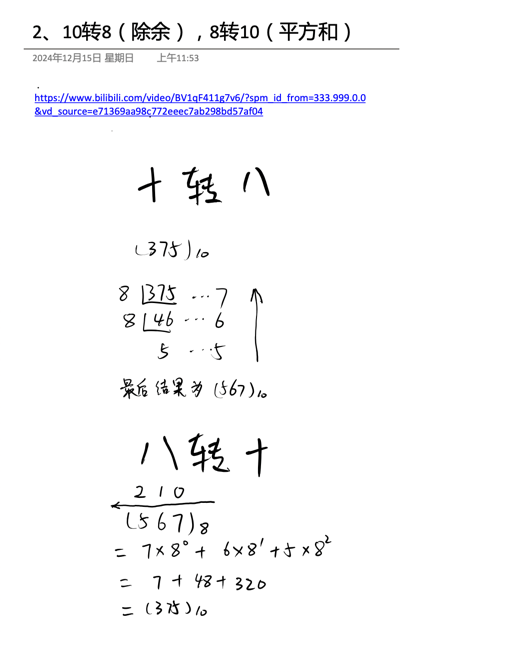
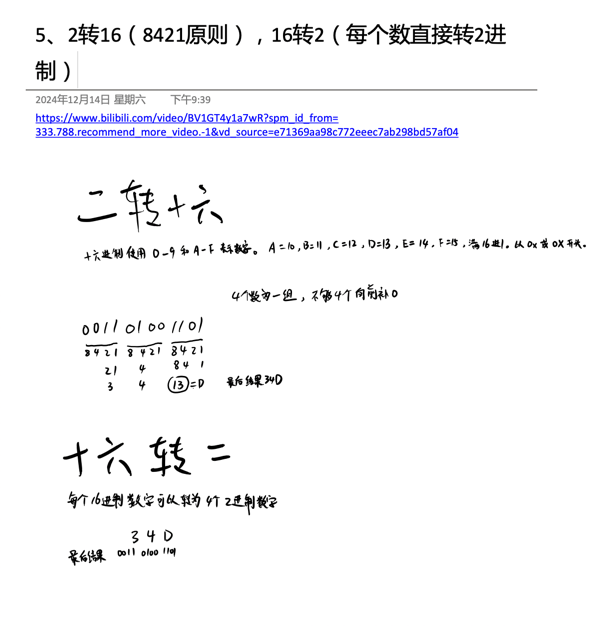

## 0062 运算符介绍
运算符是一种特殊的符号，用以表示数据的运算、赋值和比较等。
1.算数运算符
2.赋值运算符
3.关系运算符[比较运算符]
4.逻辑运算符
5.位运算符[需要二进制基础]
6.三元运算符


算数运算符
算数运算符是对数值类型的变量进行运算的，在Java程序中使用的非常多。


| 运算符 | 运算           | 范例            | 结果        |
|-----|--------------|---------------|-----------|
| +   | 正号           | +7            | 7         |
| -   | 负号           | b=11;-b       | -11       |
| +   | 加            | 9 + 9         | 18        |
| -   | 减            | 10 - 8        | 2         |
| *   | 乘            | 7 * 8         | 56        |
| /   | 除            | 9/9           | 1         |
| %   | 取模（取余）       | 11%9          | 2         |
| ++  | 自增（前）：先运算后取值 | a=2;b=++a;    | a=3;b=3;  |
| ++  | 自增（后）：先取值后运算 | a=2;b=a++;    | a=3;b=2;  |
| --  | 自减（前）：先运算后取值 | a=2;b=--a;    | a=1;b=1;  |
| --  | 自减（后）：先取值后运算 | a=2;b=a--;    | a=1;b=2;  |
| +   | 字符串相加        | "hsp" + "edu" | "hsp edu" |


## 0063 算数运算符使用
案例演示算数运算符的使用（ArithmeticOperator.java）
1.+,-,*,/,%,++,--,重点讲解/、%、++
2.自增:++
作为独立的语句使用：
前++和后++都完全等价于i=i+1;
作为表达式使用
前++：++i先自增后赋值
后++：i++先赋值后自增
3.--、+、-、*是一个道理，完全可以类推

## 0064 算数运算符练习1
ArithmeticOperatorExercise01.java
1.面试题1
int i = 1; // i -> 1
i = i++; // 规则使用临时变量：（1）temp = i;（2）i = i + 1;（3）i = temp;
System.out.println(i); // 1
问：结果是多少？为什么？

2.面试题2
int i = 1;
i = ++i; // 规则使用临时变量：（1）i = i + 1;（2）temp = i;（3）i = temp;
System.out.println(i); // 2


自增，自减课堂练习，看看输出什么
ArithmeticOperatorExercise01.java

int i1 = 10;
int i2 = 20;
int i = i1++; // i1此时为10，所以i=10
System.out.print("i=" + i); // 10
System.out.println("i2=" + i2); // 20
i = --i2;
System.out.print("i=" + i); // 19
System.out.println("i2=" + i2); // 19

## 0066 算术运算符练习3
课堂练习2
// ArithmeticOperatorExercise02.java
1.假如还有59天放假，问：合xx个星期零xx天
59/7 59%7

## 0067 算术运算符练习4
2.定义一个变量保存华氏温度，华氏温度转换摄氏温度的公式为：5/9*(华氏温度-100)，请求出华氏温度对应的摄氏温度。[234.5]

## 0068 关系运算符介绍
关系运算符（比较运算符）
1.关系运算符的结果都是boolean型，也就是要么是true，要么是false
2.关系表达式 经常用在if结构的条件中或循环结构的条件中

| 运算符        | 运算        | 范例                      | 结果    |
|------------|-----------|-------------------------|-------|
| ==         | 相等于       | 8==7                    | false |
| !=         | 不等于       | 8!=7                    | true  |
| <          | 小于        | 8<7                     | false |
| >          | 大于        | 8>7                     | true  |
| <=         | 小于等于      | 8<=7                    | false |
| >=         | 大于等于      | 8>=7                    | true  |
| instanceof | 检查是否是类的对象 | "hsp" instanceof String | true  |

## 0069 案例演示
案例演示关系运算符的使用(RelationalOperator.java)
int a = 9; // 提示：开发中，不可以使用a,b a1,bc n1,n2...
int b = 8;
System.out.println(a > b);
System.out.println(a >= b);
System.out.println(a <= b);
System.out.println(a < b);
System.out.println(a == b);
System.out.println(a != b);
boolean flag = a > b;

细节说明
1.关系运算符的结果都是boolean型，也就是要么是true，要么是false
2.关系运算符组成的表达式，我们称为关系表达式
3.比较运算符"=="不能误写成"="


## 0070 逻辑运算符介绍
介绍
用于连接多个条件（多个关系表达式），最终的结果也是一个boolean值。
1. a & b - 按位与运算符
   用途：对两个操作数的每一位执行按位与操作。
   逻辑行为：
   当 a 和 b 都为真（true）时，结果为真（true）。
   当 a 或 b 有一个为假（false）时，结果为假（false）。
   示例：
```java
   boolean a = true;
   boolean b = false;
   boolean result = a & b; // result 为 false
```
2. a && b - 逻辑与运算符（短路与）
   用途：对两个布尔操作数进行逻辑与运算。
   逻辑行为：
   当 a 和 b 都为真（true）时，结果为真（true）。
   如果 a 为假（false），则不会计算 b，结果直接为假（false）。这是短路特性。
```java 
   boolean a = true;
   boolean b = false;
   boolean result = a && b; // result 为 false
```
3. a | b - 按位或运算符
   用途：对两个操作数的每一位执行按位或操作。
   逻辑行为：
   当 a 和 b 中至少有一个为真（true）时，结果为真（true）。
   当 a 和 b 都为假（false）时，结果为假（false）。
```java
   boolean a = true;
   boolean b = false;
   boolean result = a | b; // result 为 true
```
4. a || b - 逻辑或运算符（短路或）
   用途：对两个布尔操作数进行逻辑或运算。
   逻辑行为：
   当 a 和 b 中至少有一个为真（true）时，结果为真（true）。
   如果 a 为真（true），则不会计算 b，结果直接为真（true）。这是短路特性。
```java
   boolean a = true;
   boolean b = false;
   boolean result = a || b; // result 为 true
```
5. !a - 逻辑非运算符
   用途：对一个布尔操作数进行逻辑非（取反）操作。
   逻辑行为：
   如果 a 为真（true），结果为假（false）。
   如果 a 为假（false），结果为真（true）。
```java
   boolean a = true;
   boolean result = !a; // result 为 false
```
6. a ^ b - 按位异或运算符
   用途：对两个操作数的每一位执行按位异或操作。
   逻辑行为：
   当 a 和 b 不同（一个为真，一个为假）时，结果为真（true）。
   当 a 和 b 相同（都为真或都为假）时，结果为假（false）。
   示例：
```
   java
   复制代码
   boolean a = true;
   boolean b = false;
   boolean result = a ^ b; // result 为 true
```
#### 总结
* 按位与 (a & b)：都为真时为真。
* 逻辑与 (a && b)：都为真时为真，有短路特性。
* 按位或 (a | b)：有一个为真时为真。
* 逻辑或 (a || b)：有一个为真时为真，有短路特性。
* 逻辑非 (!a)：取反操作。
* 按位异或 (a ^ b)：两个操作数不同时为真。

按位与运算符和逻辑与运算符，我看都一样啊?
在Java中，按位与运算符 & 和逻辑与运算符 && 的确在某些情况下可能会产生相似的结果，但它们有着根本不同的行为和使用场景：

按位与运算符 &
用途：按位与运算符 & 用于对两个整数的每一位执行位运算，并将结果应用于整数的每一位。
行为：它将两个操作数的对应位进行比较，只有当两个操作数的对应位都为1时，结果的对应位才为1；否则为0。
示例：
```java
复制代码
int a = 5;    // 二进制：0101
int b = 3;    // 二进制：0011
int result = a & b;  // 结果为 1，二进制：0001
```
逻辑与运算符 &&
用途：逻辑与运算符 && 用于对两个布尔操作数执行逻辑与操作。
行为：它具有短路特性，即如果第一个操作数为假（false），则不会对第二个操作数进行求值。
示例：
```java
复制代码
boolean a = true;
boolean b = false;
boolean result = a && b;  // 结果为 false
```
区别总结
操作数类型：

& 按位与运算符可以用于整数类型（如 int、long等）和布尔类型（boolean）。
&& 逻辑与运算符只能用于布尔类型（boolean）。
行为：

& 按位与运算符对每一位进行位运算。
&& 逻辑与运算符对两个布尔操作数进行逻辑运算，并具有短路特性。
使用场景：

& 用于对整数进行位操作，或者对多个布尔表达式进行按位与操作。
&& 用于对布尔表达式进行短路逻辑与操作，当第一个操作数为假时，可以避免计算第二个操作数。
虽然在某些情况下它们可能会产生相似的结果，但它们的行为和使用场景决定了它们在编程中的不同作用。


| a     | b     | a & b <br/>按位与运算符 | a && b<br/>逻辑与运算符（短路与） | a\|b<br/>按位或运算符 | a\|\|b<br/>逻辑或运算符 | !a <br/>逻辑非运算符  | a^b <br/>按位异或运算符  | 
|-------|-------|--------------|--------|------|--------|-------|-------|
| true  | true  | true         | true   | true | true   | false | false |
| true  | false | false        | false   | true | true   | false | true |
| false | true  | false        | false   | true | true   | true | true |
| false | false | false        | false   | false | false   | true | false |


## 0075 赋值运算符
赋值运算符就是将某个运算后的值，赋给指定的变量。

赋值运算符的分类

- 基本赋值运算符=
- 复合赋值运算符
+=,-=,*=,/=,%=等，重点讲解一个+=，其它的使用是一个道理
a += b; [等价 a = a + b;]
a -= b; [等价 a = a - b]


## 0076 赋值运算符细节
- 案例演示
案例演示赋值运算符的基本使用。AssignOperator.java
1.赋值基本案例[int num1 = 10]
2.+=的使用案例

- 赋值运算符特点
1.运算顺序从右向左 int num = a + b + c;
2.赋值运算符的左边只能是变量，右边可以是变量，表达式，常量值
3.复合赋值运算符等价于下面的效果
比如：a+=3;等价与a = a + 3;
4.复合赋值运算符会进行类型转换
byte b = 2; b += 3; b++;

## 0077 三元运算符
- 基本语法
条件表达式 ? 表达式1 : 表达式2;

1.如果条件表达式为true，运算后的结果是表达式1;
2.如果条件表达式为false,运算后的结果是表达式2;
 
案例演示 TernaryOperator.java
```java
int a = 10;
int b = 99;
int result = a > b ? a++ : b--;
```

## 0078 三元运算符细节

- 使用细节 TernaryOperatorDetail.java
1. 表达式1和表达式2要为可以赋给接收变量的类型（或可以自动转换）
2. 三元运算符可以转换成if-else语句
```java
int res = a > b ? a++ : --b; 
if(a > b) {
    res = a ++;
}else {
    res = --b;
}
```
课堂练习
案例：实现三个数的最大值


## 0079 三元运算符练习

- 课堂练习
- 案例：实现三个数的最大值 TernaryOperatorExercise.java


## 0080 运算符优先级
运算符号的优先级

| 优先级 | 运算符                            | 结合性     |
|--------|--------------------------------|------------|
| 1      | `()` `[]` `.`                  | 从左到右   |
| 2      | `!` `~` `++` `--`              | 从右到左   |
| 3      | `*` `/` `%`                    | 从左到右   |
| 4      | `+` `-`                        | 从左到右   |
| 5      | `<<` `>>` `>>>`                | 从左到右   |
| 6      | `<` `<=` `>` `>=` `instanceof` | 从左到右   |
| 7      | `==` `!=`                      | 从左到右   |
| 8      | `&`                            | 从左到右   |
| 9      | `^`                            | 从左到右   |
| 10     | `\|`                           | 从左到右   |
| 11     | `&&`                           | 从左到右   |
| 12     | `\|\|`                         | 从左到右   |
| 13     | `? :`                          | 从左到右   |
| 14     | `= += -= *= /= %= &=           |= ^= ~= <<= >>= >>>=` | 从右到左 |
| 15     | `,`                            | 从左到右   |

有一个口诀可以帮助记忆：

单算移关与，异或逻条赋
括号级别最高，逗号级别最低，单目 > 算术 > 位移 > 关系 > 逻辑 > 三目 > 赋值。

## 0081 标识符的命名规则和规范
- 标识符概念
1. Java对各种变量、方法和类等命名时使用的字符序列称为标识符
2. 凡是自己可以起名字的地方都叫标识符 int num1 = 90;

- 标识符的命名规则（必须遵守）

1.由26个英文字母大小写 0-9，或 $ 组成
2.数字不可以开头。int 3ab = 1; // 错误
3.不可以使用关键字和保留字，但能包含关键字和保留字
4.Java中严格区分大小写，长度无限制。int totalNum = 10;int n = 90;
5.标识符不能包含空格。int a b = 90;

## 0082 标识符练习

判断下面变量名是否正确
hsp ✔️
hsp12 ✔️
1hsp ❌ 不能数字开头
h-s ❌ 不能有-
x h ❌ 不能有空格
h$4 ✔️
class ❌ 关键字
int ❌ 关键字
double ❌ 关键字
public ❌ 关键字
static ❌ 关键字
goto ❌ 保留字
stu_name ✔️

## 0083 标识符命名规范
1.包名：多单词组成时，所有字母都小写：aaa.bbb.ccc // 比如 com.hsp.crm
2.类名、接口名：多单词组成时，所有单词的字母大写：XxxYyyZzz
比如：TankShotGame
3.变量名、方法名：多单词组成时，第一个单词首字母小写，第二个单词开始每个单词首字母大写：xxxYyyZzz 【小驼峰】      
比如：tankShotGame
4.常量名：所有字母都大写。多单词时每个单词用下划线连接：XXX_YYY_ZZZ
比如：定义一个所得税率TAX_RATE
5.后面我们学习到类，包，接口，等时，我们的命名规范要这样遵守，更加详细的看文档


## 0084 关键字保留字
关键字定义：被Java语言赋予了特殊含义，用做专门用途的字符串（单词）
关键字特点：关键字中所有字母都为小写


|               | 关键字                                                                     |
|---------------|-------------------------------------------------------------------------|
| 用于定义数据类型的关键字  | class、interface、enum、byte、short、int、long、float、double、char、boolean、void |
| 用于定义数据类型值的关键字 | true、false、null                                                         | 
| 用于定义流程控制的关键字  | if、else、switch、case、default、while、do、for、break、continue、return          |

Java保留字：现有Java版本尚未使用，但以后版本可能会作为关键字使用。自己命名标识符时要避免使用这些保留字。
byValue、cast、future、generic、inner、operator、outer、rest、var、goto、const


## 0085 键盘输入
键盘输入语句
- 介绍

在编程中，需要接收用户输入的数据，就可以使用键盘输入语句来获取。
input.java，需要一个扫描器（对象），就是Scanner

  - 步骤：
  1.导入该类的所在包，java.util.*
  2.创建该类的对象（声明变量）
  3.调用里面的功能

案例演示：
要求：可以从控制台接收用户信息，【姓名，年龄，薪水】
```java
// 步骤2：创建Scanner类的对象
Scanner input = new Scanner(System.in);
// 步骤3：调用里面的功能
System.out.println("请输入姓名：");
String name = input.next();
System.out.println("请输入年龄：");
int age = input.nextInt();
System.out.println("请输入成绩：");
double score = input.nextDouble();
System.out.println("name:" + name + " 年龄=" + age + " 成绩=" + score);
```

## 0086 四种进制介绍

对于整数，有四种表示方式：
1.二进制：0,1，满2进1，以0b或0B开头
2.十进制：0-9，满10进1
3.八进制：0-7，满8进1，以数字0开头表示
4.十六进制：是以16为基数的数字系统，其中使用0到9和A到F表示数字。A代表10，B代表11，C代表12，D代表13，E代表14，F代表15,满16进1。以0x或0X开头表示。此处的A-F不区分大小写。

-举例说明 BinaryTest.java
```
int n1 = 0b1010;
int n2 = 1010;
int n3 = 01010;
int n4 = 0x10101;
```








## 0097 位运算思考题
1.请看下面的代码，回答a,b,c,d,e结果是多少？
```
public static void main(String[] args) {
   int a = 1 >> 2; // 1向右位移2位
   int b = -1 >> 2;
   int c = 1 << 2;
   int d = -1 << 2;
   int e = 3>>>2;
   // a,b,c,d,e结果是多少
   System.out.println("a=" + a);
   System.out.println("b=" + b);
   System.out.println("c=" + c);
   System.out.println("d=" + d);
   System.out.println("e=" + e);
}
```

2.请回答在java中，下面的表达式运算的结果是：（位操作）
```
~2=?
2%3=?
2|3=?
~-5=?
13&7=?
5|4=?
-3^3=?//^按位异或
```

## 0098 原码 反码 补码

1.二进制是逢2进位的进制位
2.现代的电子计算机技术全部采用的是二进制，因为它只使用0、1两个数字符号，非常简单方便，易于用电子方式实现。计算机内部处理的信息，都是采用二进制数来表示的。二进制（Binary）数用0和1两个数字及其组合来表示任何数。进位规则是“逢2进1”，数字1在不同的位上代表不同的值，按从右往左的次序，这个值以2的倍数递增。


[原码, 反码, 补码 详解](https://www.cnblogs.com/zhangziqiu/archive/2011/03/30/ComputerCode.html)


网上对于原码、反码、补码的解释过于复杂，这里精简几句话（背下来）
对于有符号的而言：

1.二进制的最高位是符号位：0表示整数，1表示负数
2.正数的原码反码补码都一样
3.负数的反码=原码的符号位不变，其它位取反
4.负数的补码=反码+1；负数的反码=补码-1
5.0的反码、补码都是0
6.java没有无符号数，换言之，java中的数都是有符号的
7.在计算机运算的时候，都是以补码来运算的
8.当我们看运算结果的时候，要看他的原码


## 0099 位运算

- java有7个位运算（&、|、^、~、>>，<<和>>>）
分别是 按位与&、按位或|、按位异或^，按位取反~，它们的运算规则是：

按位与&： 两位全为1，结果为1，否则为0
按位或|：两位有一个为1，结果为1，否则为0
按位异或^：两位一个为0，一个为1，结果为1，否则为0
按位取反~: 0 -> 1, 1 -> 0
比如： 2&3=?    ~2=?   2|3=?   2^3=?

完成前面的案例

