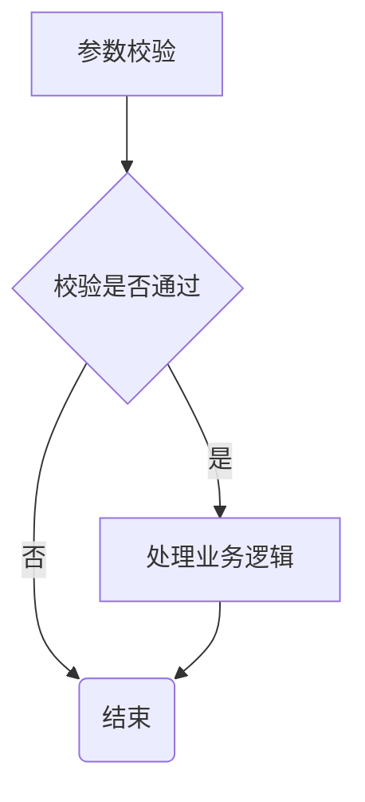

# 0103 程序流程控制介绍
在程序中，程序运行的流程控制决定程序是如何执行的，是我们必须要掌握的，主要有三大流程控制语句

1.顺序控制
2.分支控制
3.循环控制

## 0104 顺序控制
顺序控制介绍
程序从上到下逐行地执行，中间没有任何判断和跳转

- 顺序控制举例和注意事项
  
Java中定义变量采用合法的向前引用。
正确形式
```
public class Test {
    int num1 = 12;
    int num2 = num1 + 12;
}
```
错误形式
```
public class Test {
    int num2 = num1 + 2; // 错误
    int num1 = 12;
}
```

执行语句1 -> 执行语句2 -> ······ -> 执行语句n


## 分支控制if-else
分支控制if-else介绍
让程序有选择的执行，分支控制有三种

1.单分支
2.双分支
3.多分支


### 单分支
基本语法
if(条件表达式) {
    执行代码块;（可以有多条语句）
}

- 说明：当条件表达式为true时，就会执行{}的代码。如果为false，就不执行。特别说明，如果{}中只有一条语句，则可以不用{},建议写上{}

案例说明
请大家看个案例[If01.java]
编写一个程序，可以输入人的年龄，如果该同志的年龄大于18岁，则输出"你年龄大于18，要对自己的行为负责，送入监狱"

### 0105 单分支流程图


### 0106 双分支使用
基本语法
if(条件表达式) {
    执行代码块1;
}else {
    执行代码块2;
}

说明：当条件表达式成立，即执行代码块1，否则执行代码块2。如果执行代码块，只有一条语句，则{}可以省略，否则不能省略
案例说明
请大家看个案例[If02.java]
编写一个程序，可以输入人的年龄，如果该同志的年龄不大于18岁，则输出"你年龄大于18，要对自己的行为负责，送入监狱"。否则，输出"你的年龄不大这次放过你了"

