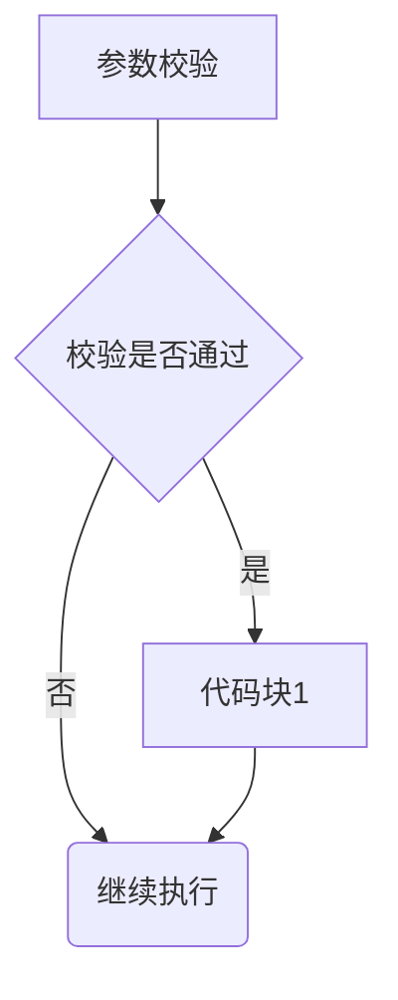
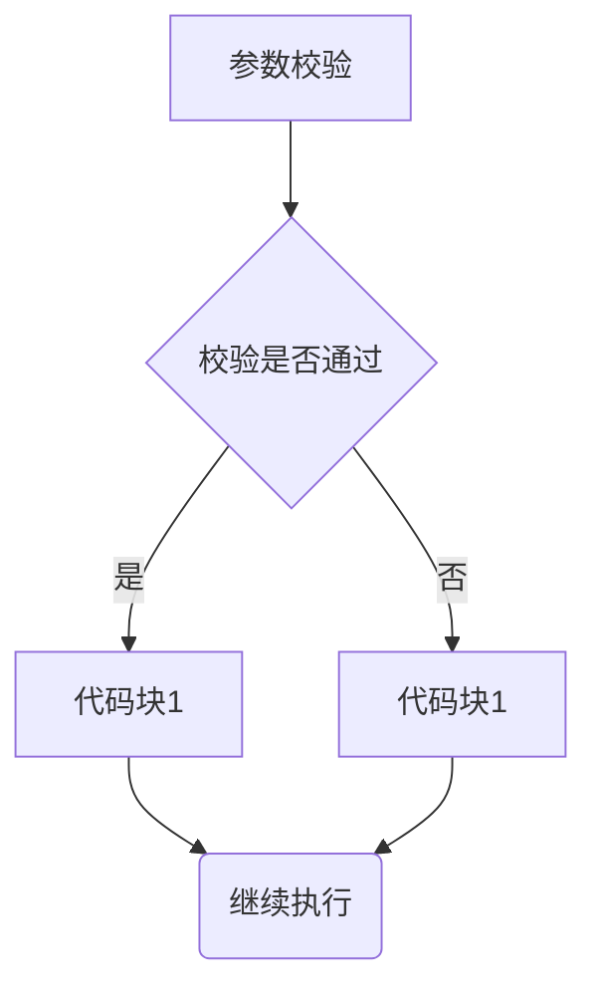
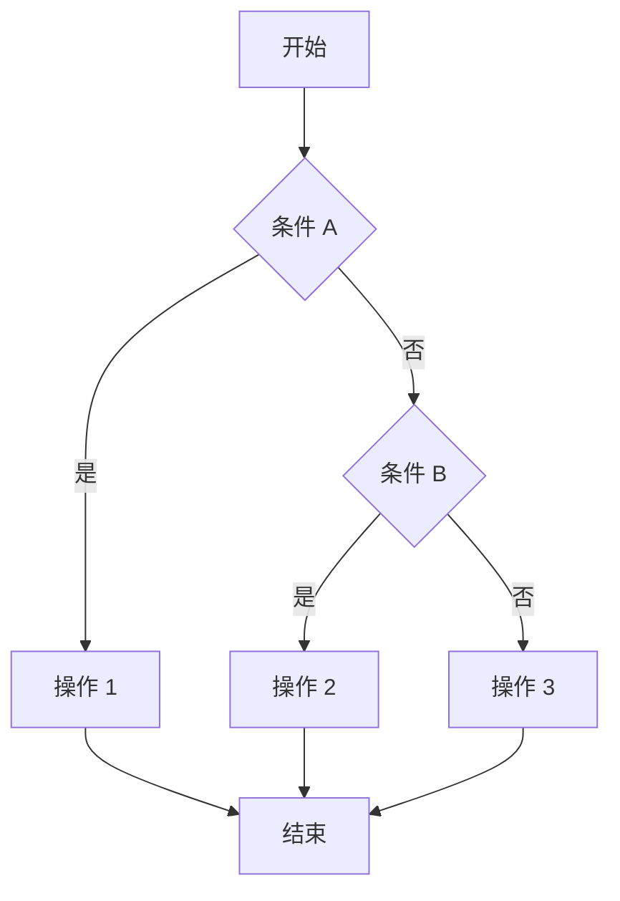
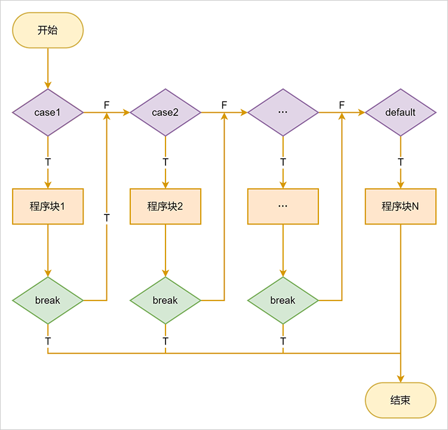
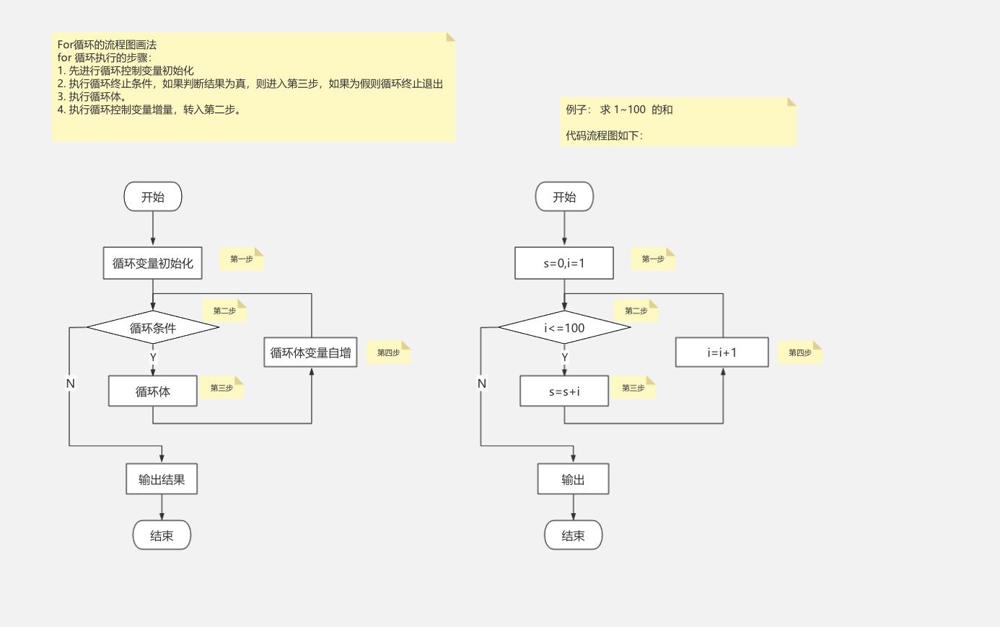
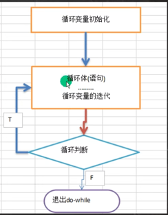
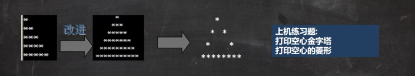
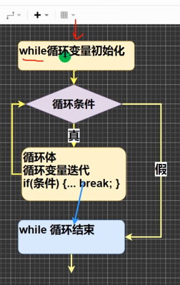
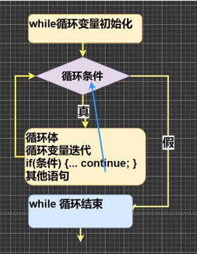

# 0103 程序流程控制介绍
在程序中，程序运行的流程控制决定程序是如何执行的，是我们必须要掌握的，主要有三大流程控制语句

1.顺序控制
2.分支控制
3.循环控制

## 0104 顺序控制
顺序控制介绍
程序从上到下逐行地执行，中间没有任何判断和跳转

- 顺序控制举例和注意事项
  
Java中定义变量采用合法的向前引用。
正确形式
```
public class Test {
    int num1 = 12;
    int num2 = num1 + 12;
}
```
错误形式
```
public class Test {
    int num2 = num1 + 2; // 错误
    int num1 = 12;
}
```

执行语句1 -> 执行语句2 -> ······ -> 执行语句n


## 分支控制if-else
分支控制if-else介绍
让程序有选择的执行，分支控制有三种

1.单分支
2.双分支
3.多分支


### 单分支
基本语法
if(条件表达式) {
    执行代码块;（可以有多条语句）
}

- 说明：当条件表达式为true时，就会执行{}的代码。如果为false，就不执行。特别说明，如果{}中只有一条语句，则可以不用{},建议写上{}

案例说明
请大家看个案例[If01.java]
编写一个程序，可以输入人的年龄，如果该同志的年龄大于18岁，则输出"你年龄大于18，要对自己的行为负责，送入监狱"

### 0105 单分支流程图


### 0106 双分支使用
基本语法
if(条件表达式) {
    执行代码块1;
}else {
    执行代码块2;
}

说明：当条件表达式成立，即执行代码块1，否则执行代码块2。如果执行代码块，只有一条语句，则{}可以省略，否则不能省略
案例说明
请大家看个案例[If02.java]
编写一个程序，可以输入人的年龄，如果该同志的年龄不大于18岁，则输出"你年龄大于18，要对自己的行为负责，送入监狱"。否则，输出"你的年龄不大这次放过你了"

### 0107 双分支流程图



### 0108 双分支练习题
单分支和双分支练习题
1.对下列代码，若有输出，指出输出结果
```java
int x = 7;
int y = 4;
if(x > 5) {
    if(y > 5) {
        System.out.println(x + y);
    }
    System.out.println("老韩");
}else
    System.out.println("x is" + x);
```
// 输出的内容是？
老韩

2.编写程序，声明2个double型变量并赋值。判断第一个数大于10.0，且第2个数小于20.0，打印两个数之和。
3.定义两个变量int，判断二者的和，是否能被3整除又能被5整除，打印提示信息
4.判断一个年份是否是闰年，闰年的条件是符合下面两者之一：(1)年份能被4整除，但不能被100整除 （2）能被400整除

### 0109 多分支使用
- 基本语法
```
if(条件表达式1) {
    执行代码块1;
}
else if() { 
    执行代码块2;
}
...
else { 
    执行代码块2;
}
```

特别说明：
1. 多分支可以没有else
2. 如果所有的条件表达式都不成立，则一个执行入口都没有 
3. 如果有else，所有条件表达式都不成立的时候，则执行else代码块




### 0110 多分支练习1
案例演示1
请大家看案例[If03.java]

请输入保国同志的芝麻信用分：
如果：
1.信用分为100分时，输出信用极好
2.信用分为(80,99)时，输出信用优秀
3.信用分为[60,80]时，输出信用一般
4.其它情况，输出信用不及格
5.请从键盘输入保国的芝麻信用分，并加以判断

### 0111 多分支练习2
案例演示2

// 下面代码，看看输出什么
```java
boolean b = true;
if(b == false) 
    System.out.println("a");
else if(b)
    System.out.println("b");
else if(!b)
    System.out.println("c");
else
    System.out.println("d");
```

### 0112 嵌套分支
基本介绍
在一个分支结构中又完整的嵌套了另一个分支结构，里面的分支结构称为内层分支，外面的分支称为外层分支。
老师建议：不要超过3层（可读性不好）

基本语法
```java
if() {
    if() {
        // if-else    
    }else {
        // if-else
    }    
}
```

应用案例
参加歌手比赛，如果初赛成绩大于0.8进入决赛，否则提示淘汰。
并且根据性别提示进入男子组或女子组。
输入成绩和性别，进行判断和输出信息。[NestedIf.java]

提示：
- double score; char gender; 
- 接收字符：char gender = scanner.next().charAt(0);

### 0113 嵌套分支课后练习
应用案例
出票系统：根据淡旺季的月份和年龄，打印票价

4月-10月 旺季：
- 成人(18-60)：60
- 儿童(<18)：半价
- 老人(>60)：1/3

淡季
- 成人：40
- 其他：20

### 0114 switch基本语法
基本语法
```java
public class MyProgram {
    public static void main(String[] args) {
        switch (expression) {
            case value1:
                // 如果 expression 的值等于 value1，执行此代码块
                break;
            case value2:
                // 如果 expression 的值等于 value2，执行此代码块
                break;
            case value3:
                // 如果 expression 的值等于 value3，执行此代码块
                break;
            default:
                // 如果 expression 的值不匹配任何 case，执行此代码块
        }
    }
}
```
关键点：
1. expression 必须是 byte、short、char、int、String（Java 7 及以后版本支持）、enum枚举类型或者某些特定的类类型。
2. case 后跟常量值，用于与 expression 的值进行匹配。
3. break 语句用于跳出 switch 语句。如果没有 break，会继续执行后续的 case 或者 default 代码块，直到遇到 break 或者 switch 结束。
4. default 是可选的，它是当所有 case 都不匹配时执行的代码块

### 0115 switch流程图



### 0116 switch快速入门
案例：Switch01.java
1.请编写一个程序，该程序可以接收一个字符，比如：a,b,c,d,e,f,g
2.a表示星期一，b表示星期二
3.根据用户的输入显示的信息，要求使用switch语句完成


### chatgpt对于switch的解释

Java 中的 switch 语句是一种控制流语句，用于基于不同的条件执行不同的代码块。它通常用来代替一系列的 if-else 语句，尤其当多个条件判断针对同一个变量时，switch 语句能提供更简洁和高效的解决方案。

基本语法：
```java
switch (expression) {
    case value1:
        // 语句1
        break;
    case value2:
        // 语句2
        break;
    case value3:
        // 语句3
        break;
    default:
        // 默认语句
}
```
关键组成部分：
1. switch 表达式： switch 后跟随的表达式是一个用于计算的值。这个表达式的结果会与 case 标签中的值进行比较。支持的类型有：

- byte, short, int, char
- String（Java 7及以后支持）
- enum（枚举类型）
2. case 标签： case 后面的值是具体的匹配值。switch 会将表达式的结果与这些值进行比较。如果匹配，则执行对应的代码块。

3. break 语句： 每个 case 语句块后通常都会有一个 break 语句，表示结束当前 switch 的执行，跳出 switch 语句。如果没有 break，程序会继续执行下一个 case 块的代码（即“fall-through”行为）。

4. default 语句： default 是可选的，它在所有 case 值都不匹配时执行。default 语句没有条件，它通常作为“捕获”任何未处理的情况。如果没有 default，并且所有 case 不匹配，switch 不会做任何事。

例子：
1. 基本使用
```java
int day = 3;
switch (day) {
    case 1:
        System.out.println("Monday");
        break;
    case 2:
        System.out.println("Tuesday");
        break;
    case 3:
        System.out.println("Wednesday");
        break;
    case 4:
        System.out.println("Thursday");
        break;
    case 5:
        System.out.println("Friday");
        break;
    case 6:
        System.out.println("Saturday");
        break;
    case 7:
        System.out.println("Sunday");
        break;
    default:
        System.out.println("Invalid day");
}
```
   输出：
```java
Wednesday
```

2. 使用 String 类型（Java 7及以上）
 ```java
String color = "red";
switch (color) {
    case "red":
        System.out.println("Color is Red");
        break;
    case "green":
        System.out.println("Color is Green");
        break;
    case "blue":
        System.out.println("Color is Blue");
        break;
    default:
        System.out.println("Unknown color");
}
```
输出：
```java
Color is Red
```

3. 使用 enum 类型（Java 5及以上）
```java
enum Day {
    MONDAY, TUESDAY, WEDNESDAY, THURSDAY, FRIDAY, SATURDAY, SUNDAY
}

Day day = Day.WEDNESDAY;
switch (day) {
    case MONDAY:
        System.out.println("Start of the work week");
        break;
    case WEDNESDAY:
        System.out.println("Middle of the week");
        break;
    case FRIDAY:
        System.out.println("End of the work week");
        break;
    default:
        System.out.println("Weekend");
}
```
输出：
```java
Middle of the week
```
4. 使用“fall-through”行为（没有 break）
```java
int number = 2;
switch (number) {
    case 1:
    case 2:
    case 3:
        System.out.println("Number is between 1 and 3");
        break;
    case 4:
        System.out.println("Number is 4");
        break;
    default:
        System.out.println("Number is out of range");
}
```
输出：
```java
Number is between 1 and 3
```
这里，case 1, case 2, 和 case 3 没有 break，所以它们都会执行相同的代码块。

关键注意事项：
匹配顺序： switch 会按照 case 的顺序进行匹配。如果找到匹配的 case，会执行对应的代码，并跳出 switch 语句（如果有 break）。如果没有匹配的 case，则会执行 default 语句（如果有的话）。

break 的作用： break 语句用于跳出 switch 语句，如果不加 break，程序会继续执行下一个 case，这就是所谓的“fall-through”行为。例如，如果你在多个 case 下想执行相同的代码块，可以省略 break。

不能使用浮动类型： switch 语句不支持 float, double, 或 long 类型。

无法使用对象（除 String 和 enum）： switch 语句不支持其他对象类型，像 Object 或 ArrayList 等类型不能直接作为 switch 的表达式。

总结：
switch 语句提供了一种根据不同条件执行不同代码的方式，特别适用于多个条件基于同一变量的情况。它比多个 if-else 语句更简洁且易读，但需要注意其适用的类型、fall-through 行为和 break 的使用。

### 0117 switch细节
- switch注意事项和细节讨论
SwitchDetail.java
1.表达式数据类型，应和case后的常量类型一致，或者是可以自动转成可以相互比较的类型，比如输入的是char，而常量是int
2.switch（表达式）中表达式的返回值必须是：(byte、short、char、int、String、enum)
```java
public class SwitchDetail {
    public static void main(String[] args) {
        double c = 1.1;
        switch (c) {
            case 1.1: // 错误
                System.out.println("I'm one");
                break;
        }
    }
}
```
3.case字句的值必须是常量或者是常量表达式，而不能是变量
4.default字句是可选的，当没有匹配的case时，执行default
5.break语句用来在执行完一个case分支后使程序跳出switch语句块；如果没有写break，不再匹配后面的case，直接执行后面case中的代码块，直到遇见了break


### 0118 switch课堂练习1 
SwitchExercise.java
1.使用switch把小写类型的char型转为大写（键盘输入）。只转换a,b,c,d,e。其它的输出"other"
2.对学生成绩大于60分的，输出“合格”。低于60分的，输出“不合格”（注：输入的成绩不能大于100），提示成绩/60

### 0119 switch课堂练习2
3.根据用于指定月份，打印该月份所属的季节。3，4，5春季 6，7，8夏季 9，10，11 秋季  12 1 2 冬季[课堂练习，提示使用穿透]


### 0120 switch和if选择
switch和if的比较
1.如果判断你的具体数值不多，而且符合byte、short、int、char、enum、string这6种类型。虽然两个语句都可以使用，建议使用switch语句。
2.其它情况：对区间判断，对结果为boolean类型判断，使用if。if的使用范围更广

### 0121 for循环控制
基本介绍：听其名而知其意，就是让你的代码可以循环的执行

- 看一个实际需求
请大家看个案例[For01.java]:编写一个程序，可以打印10句 "你好，韩顺平"
请大家想想怎么做

- 基本语法
for(循环变量初始化;循环条件;循环变量迭代) {
    循环操作(可以多条语句);
}

老韩说明
1.for关键字，表示循环控制
2.for有四要素：(1)循环变量初始化(2)循环条件(3)循环变量迭代(4)循环操作
3.循环操作，这里可以有多条语句，也就是我们要循环执行的代码
4.如果循环操作（语句）只有一条语句，可以省略{}，建议不要省略

### 0122 for执行流程
for循环执行流程分析





###  0123 for细节
注意事项和细节说明

ForDetail.java
1.循环条件返回一个布尔值的表达式
2.for(;循环条件;)中的初始化和变量迭代可以写到其它地方，但是两边的分号不能省略
3.循环初始值可以有多条初始化语句，但要求类型一样，并且中间用逗号隔开，循环变量迭代也可以有多条变量迭代语句，中间用逗号隔开
4.使用内存分析法，老师分析下面代码输出的什么？
```java
int count = 3;
for(int i = 0,j = 0; i < count; i++, j += 2){
    System.out.println("i="+i +"j="+j);
}
```

### 0124 for编程思想1
for循环练习题（学员先做）
ForExercise.java
1.打印1~100之间所有是9的倍数的整数，统计个数及总和
2.完成下面的表达式输出
0 + 5 = 5
1 + 4 = 5
2 + 3 = 5
3 + 2 = 5
4 + 1 = 5
5 + 0 = 5


### 0125 while基本语法
- 基本语法
循环变量初始化;
while(循环条件) {
    循环体(语句);
    循环变量迭代;
}
- 说明
1.while循环也有四要素
2.只是四要素放的位置和for循环不一样

### 0127 while执行流程
while循环流程分析


### 0128 while课堂练习
课堂练习题
WhileExercise.java
1.打印1-100之间所有能被3整除的数[使用while，老师评讲]
2.打印40-200之间所有的偶数[使用while了，课后练习]

### 0129 do while语法
- 基本语法
循环变量初始化
- do{
    循环体(语句);
    循环变量迭代;
}while(循环条件);

- 老韩说明：
1.do while是关键字
2.也有循环四要素，只是位置不一样
3.先执行，再判断，也就是说，一定会执行一次
4.最后有一个分号
5.while和do while 区别。举例：要账

### 0130 do while执行流程
do while 循环执行流程分析


注意事项和细节说明
1.循环条件是返回一个布尔值的表达式
2.do while循环是先执行，再判断，因此它至少执行一次

### 0131 dowhile练习1
1.打印1-100
2.计算1-100的和
3.统计1-200之间能被5整除但不能被3整除的个数

### 0132 dowhile练习2
4.如果李三不还钱，则老韩将一直使出五连鞭，知道老三说还钱为止

### 0133 多重循环执行流程
- 介绍
1.将一个循环放在另一个循环体内，就形成了嵌套循环。其中，for，while，do..while
均可以作为外层循环和内层循环[建议一般使用两层，最多不要超过3层，否则代码的可读性很差]

2.实质上，嵌套循环就是把内层循环当成外层循环的循环体。当只有内层循环的循环条件为false时，
才会完全跳出内层循环，才可结束外层的当次存换，开始下一次的循环

3.设外层循环次数为m次，内层为n次，则内层循环体实际上需要执行m*n次
```java
for(int i = 1; i<= 7; i++) {
    for(int j = 1;j <= 2;j++) {
        System.out.println("ok~~"); // 7 * 2 = 14
    }
}
```

多重循环执行步骤分析：
请分析下面的多重循环执行步骤，并写出输出 => 韩老师的内存分析法
// 双层for
```java
for(int i = 0; i < 2; i++) {
    for(int j = 0;j < 3; j++) {
        System.out.println("i=" + i + "j=" + j);
    }
}
```
i=0 j=0
i=0 j=1
i=0 j=2
i=1 j=0
i=1 j=1
i=1 j=2

### 0134 多重循环练习1
应用实例：
MulForExercise01.java
1.统计3个班成绩情况，每个班有5名同学，求出各个班的平均分和所有班级的平均分[学生的成绩从键盘输入]
2.统计3个班及格人数，每个班有5名同学
3.打印出九九乘法表[课后题]

### 0135 多重循环控制
- 经典的打印金字塔 
使用for循环完成下面的案例
请编写一个程序，可以接收一个整数，表示层数（totalLevel），打印出金字塔
  (Stars.java)



### 0136 空心金字塔
Stars.java

### 0137 break需求
看下面一个需求
随机生成1-100的一个数，直到生成了97这个数，看看你一共用了几次？
随机使用(int)(Math.random() * 100) + 1

### 0138 break执行流程
- 基本语句介绍：
break语句用于终止某个语句块的执行，一般使用在switch或者循环[for，while，do-while]中
- 基本语法
{
    break;
}
- 以while使用break为例，画出示意图


### 0139 break快速入门
跳转控制语句
Break01.java

### 0140 break细节
- 注意事项和细节说明
1.break语句出现在多层嵌套的语句块中时，可以通过标签指明要终止的是哪一层语句块BreakDetail.java
2.标签的基本使用
```java
public class BreakLabelExample {
    public static void main(String[] args) {
        outerLoop:  // 给外层循环打标签
        for (int i = 1; i <= 3; i++) {
            for (int j = 1; j <= 3; j++) {
                System.out.println("i = " + i + ", j = " + j);
                if (i == 2 && j == 2) {
                    break outerLoop;  // 跳出 outerLoop 标签对应的循环
                }
            }
        }
        System.out.println("跳出了外层循环");
    }
}
```


老韩解读
1.break语句可以指定退出哪层
2.label1是标签，名字由程序员指定
3.break后指定到哪个label就退出到哪里
4.在实际的开发中，老韩尽量不使用标签
5.如果没有指定break，默认退出最近的循环体

### 0141 break课堂练习1

BreakExercise.java
1. 1-100以内的数求和，求出当和第一次大于20的当前数 [for + break]
2. 
### 0142 break课堂练习2
2. 实现登录验证，有3次机会，如果用户名为"丁真"，密码"666"提示登录成功，否则提示还有几次机会，请使用for+break完成

### 0143 跳转控制语句-continue
- 基本介绍
1. continue语句用于结束本次循环，继续执行下一次循环
2. continue语句出现在多层嵌套的循环语句体中时，可以通过标签指明要跳过的是哪一层循环，这个和前面标签的使用规则一样

- 基本语法
```java
{
    ......
    continue;    
    ......    
}
```
- 以while使用continue为例，画出示意图


### 0144 continue快速入门
- 快速入门案例
Continue01.java
```java
int i = 1;
while (i <= 4) {
    i++;
    if(i == 2) {
        continue;
    }
    System.out.println("i=" + i);
}
```

### 0145 continue细节
- 细节案例分析和说明：
ContinueDetail.java
```java
label1:
for(int j = 0; j < 4; j++) {
    label2:
    for(int i = 0; i < 10; i++) {
        if(i == 2) {
            // 看看分别输出什么值，并分析
            // continue
            // continue label2;
            continue label1;
        }
        System.out.println("i = " + i);
    }
}
```

### 0146 return使用说明
- 介绍
return使用在方法，表示跳出所在的犯法，在讲解方法的时候，会详细的介绍，
这里我们简单的提一下。注意：如果return写在main方法，退出程序..
Return01.java
```java
for(int i = 1; i <=5; i++) {
    if(i == 3) {
        System.out.println("韩顺平" + i);
        return;
    }    
    System.out.println("Hello World!");
}
System.out.println("go on..");
```

### 0147 本章作业1
1.编程实现如下功能
某人有100，000元，每次经过一次路口，需要交费，规则如下：
1）当现金>50000时，每次交5%
2）当现金<=50000时，每次交1000
编程计算该人可以经过多少次路口,要求：使用 while break方式完成

2.实现判断一个整数，属于哪个范围：大于0；小于0；等于0
3.判断一个年份是否为闰年
4.判断一个整数是否是水仙花数，所谓水仙花数是指一个3位数，其各个位数数字立方和等于其本身。例如：153 = 1 * 1 * 1 + 3 * 3 * 3 + 5 * 5 * 5
5.看看下面代码输出什么？
```java
class Demo {
    public static void main(String[] args) {
        int m = 0, n = 3;
        if(m > 0) {
            if(n > 2) {
                System.out.println("OK1");
            }else {
                System.out.println("OK2");
            }
        }
    }
}
```
6.输出1-100之间的不能被5整除的数，每5个一行
7.输出小写的a-z以及大写的Z-A
8.求出1-1/2 + 1/3 - 1/4 ... 1/100的和
9.求 1 + (1 + 2) + (1 + 2 + 3) + (1 + 2 + 3 + 4) + ... + (1 + 2 + 3 + .. + 100)的结果


