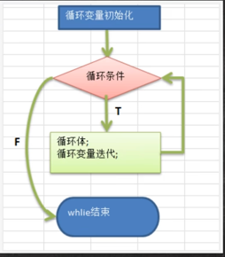

# 0103 程序流程控制介绍
在程序中，程序运行的流程控制决定程序是如何执行的，是我们必须要掌握的，主要有三大流程控制语句

1.顺序控制
2.分支控制
3.循环控制

## 0104 顺序控制
顺序控制介绍
程序从上到下逐行地执行，中间没有任何判断和跳转

- 顺序控制举例和注意事项
  
Java中定义变量采用合法的向前引用。
正确形式
```
public class Test {
    int num1 = 12;
    int num2 = num1 + 12;
}
```
错误形式
```
public class Test {
    int num2 = num1 + 2; // 错误
    int num1 = 12;
}
```

执行语句1 -> 执行语句2 -> ······ -> 执行语句n


## 分支控制if-else
分支控制if-else介绍
让程序有选择的执行，分支控制有三种

1.单分支
2.双分支
3.多分支


### 单分支
基本语法
if(条件表达式) {
    执行代码块;（可以有多条语句）
}

- 说明：当条件表达式为true时，就会执行{}的代码。如果为false，就不执行。特别说明，如果{}中只有一条语句，则可以不用{},建议写上{}

案例说明
请大家看个案例[If01.java]
编写一个程序，可以输入人的年龄，如果该同志的年龄大于18岁，则输出"你年龄大于18，要对自己的行为负责，送入监狱"

### 0105 单分支流程图


### 0106 双分支使用
基本语法
if(条件表达式) {
    执行代码块1;
}else {
    执行代码块2;
}

说明：当条件表达式成立，即执行代码块1，否则执行代码块2。如果执行代码块，只有一条语句，则{}可以省略，否则不能省略
案例说明
请大家看个案例[If02.java]
编写一个程序，可以输入人的年龄，如果该同志的年龄不大于18岁，则输出"你年龄大于18，要对自己的行为负责，送入监狱"。否则，输出"你的年龄不大这次放过你了"

### 0107 双分支流程图


### 0108 双分支练习题
单分支和双分支练习题
1.对下列代码，若有输出，指出输出结果
```java
int x = 7;
int y = 4;
if(x > 5) {
    if(y > 5) {
        System.out.println(x + y);
    }
    System.out.println("老韩");
}else
    System.out.println("x is" + x);
```
// 输出的内容是？
老韩

2.编写程序，声明2个double型变量并赋值。判断第一个数大于10.0，且第2个数小于20.0，打印两个数之和。
3.定义两个变量int，判断二者的和，是否能被3整除又能被5整除，打印提示信息
4.判断一个年份是否是闰年，闰年的条件是符合下面两者之一：(1)年份能被4整除，但不能被100整除 （2）能被400整除

### 0109 多分支使用
- 基本语法
```
if(条件表达式1) {
    执行代码块1;
}
else if() { 
    执行代码块2;
}
...
else { 
    执行代码块2;
}
```

特别说明：
1. 多分支可以没有else
2. 如果所有的条件表达式都不成立，则一个执行入口都没有 
3. 如果有else，所有条件表达式都不成立的时候，则执行else代码块


### 0110 多分支练习1
案例演示1
请大家看案例[If03.java]

请输入保国同志的芝麻信用分：
如果：
1.信用分为100分时，输出信用极好
2.信用分为(80,99)时，输出信用优秀
3.信用分为[60,80]时，输出信用一般
4.其它情况，输出信用不及格
5.请从键盘输入保国的芝麻信用分，并加以判断

### 0111 多分支练习2
案例演示2

// 下面代码，看看输出什么
```java
boolean b = true;
if(b == false) 
    System.out.println("a");
else if(b)
    System.out.println("b");
else if(!b)
    System.out.println("c");
else
    System.out.println("d");
```

### 0112 嵌套分支
基本介绍
在一个分支结构中又完整的嵌套了另一个分支结构，里面的分支结构称为内层分支，外面的分支称为外层分支。
老师建议：不要超过3层（可读性不好）

基本语法
```java
if() {
    if() {
        // if-else    
    }else {
        // if-else
    }    
}
```

应用案例
参加歌手比赛，如果初赛成绩大于0.8进入决赛，否则提示淘汰。
并且根据性别提示进入男子组或女子组。
输入成绩和性别，进行判断和输出信息。[NestedIf.java]

提示：
- double score; char gender; 
- 接收字符：char gender = scanner.next().charAt(0);

### 0113 嵌套分支课后练习
应用案例
出票系统：根据淡旺季的月份和年龄，打印票价

4月-10月 旺季：
- 成人(18-60)：60
- 儿童(<18)：半价
- 老人(>60)：1/3

淡季
- 成人：40
- 其他：20

### 0114 switch基本语法
基本语法
```java
public class MyProgram {
    public static void main(String[] args) {
        switch (expression) {
            case value1:
                // 如果 expression 的值等于 value1，执行此代码块
                break;
            case value2:
                // 如果 expression 的值等于 value2，执行此代码块
                break;
            case value3:
                // 如果 expression 的值等于 value3，执行此代码块
                break;
            default:
                // 如果 expression 的值不匹配任何 case，执行此代码块
        }
    }
}
```
关键点：
1. expression 必须是 byte、short、char、int、String（Java 7 及以后版本支持）、枚举类型或者某些特定的类类型。
2. case 后跟常量值，用于与 expression 的值进行匹配。
3. break 语句用于跳出 switch 语句。如果没有 break，会继续执行后续的 case 或者 default 代码块，直到遇到 break 或者 switch 结束。
4. default 是可选的，它是当所有 case 都不匹配时执行的代码块

### 0115 switch流程图



### 0116 switch快速入门
案例：Switch01.java
1.请编写一个程序，该程序可以接收一个字符，比如：a,b,c,d,e,f,g
2.a表示星期一，b表示星期二
3.根据用户的输入显示的信息，要求使用switch语句完成


