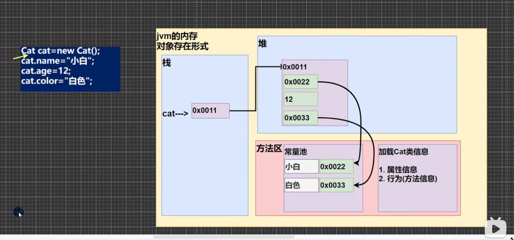

类与对象
一个程序就是一个世界，现实世界有很多事物（对象[属性，行为]）

类与对象的关系示意图

1.把所有猫的特性（属性）提取出来
2.猫类Cat:自定义数据类型 
  int：Java提供的数据类型

猫类（Cat）-数据类型
属性
name,age,color
行为
run,cry,eat

3.猫对象（具体的一只猫）
100，200，300

对象（实例）
对象（实例）

注意：从猫类到对象，目前有几种说法：1.创建一个对象 2.实例化一个对象 3.把类实例化
当然：上面的猫也可以是鱼，狗，人 Java最大的特点就是面向对象

类和对象的区别和联系
通过上面的案例和讲解我们可以看出：
1.类是抽象的，概念的，代表一类事物，比如人类，猫类...，即它是数据类型。
2.对象是具体的，实际的，代表一个具体事物，即是实例。
3.类是对象的模板，对象是类的一个个体，对应一个实例。

对象在内存中存在形式（重要的）

