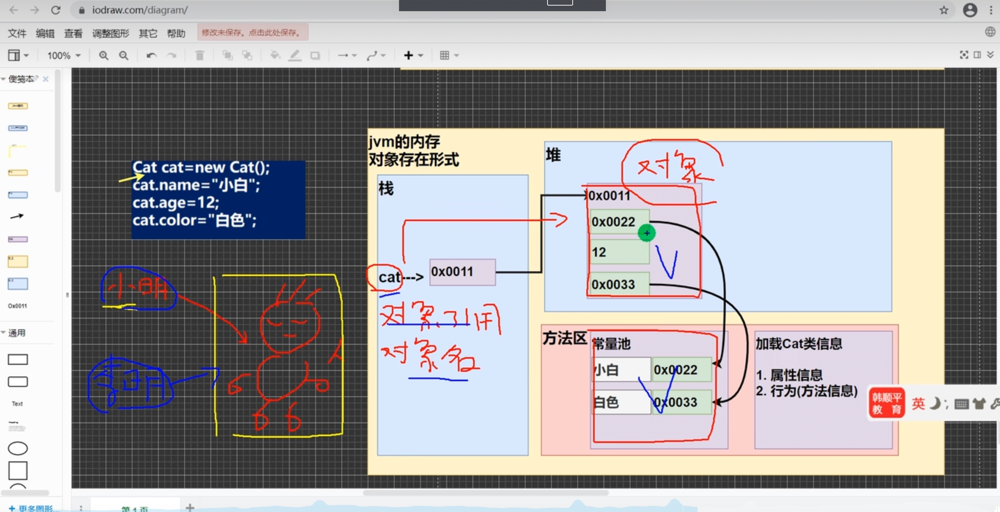

类与对象
一个程序就是一个世界，现实世界有很多事物（对象[属性，行为]）

类与对象的关系示意图

1.把所有猫的特性（属性）提取出来
2.猫类Cat:自定义数据类型 
  int：Java提供的数据类型

猫类（Cat）-数据类型
属性
name,age,color
行为
run,cry,eat

3.猫对象（具体的一只猫）
100，200，300

对象（实例）
对象（实例）


注意：从猫类到对象，目前有几种说法：1.创建一个对象 2.实例化一个对象 3.把类实例化
当然：上面的猫也可以是鱼，狗，人 Java最大的特点就是面向对象

类和对象的区别和联系
通过上面的案例和讲解我们可以看出：
1.类是抽象的，概念的，代表一类事物，比如人类，猫类...，即它是数据类型。
2.对象是具体的，实际的，代表一个具体事物，即是实例。
3.类是对象的模板，对象是类的一个个体，对应一个实例。


0194 对象在内存中存在形式（重要的）


0195 属性概念
属性/成员变量
基本介绍
1.从概念或叫法上看：成员变量 = 属性 = field(字段)（即成员变量是用来表示属性的，授课中，统一叫属性）
案例演示：Car(name,price,color) Object02.java

2.属性是类的一个组成部分，一般是基本数据类型，也可是引用类型（对象，数组）。比如我们前面定义猫类的int age就是属性


0196 属性注意细节
注意事项和细节说明
PropertiesDetail.java
1.属性的定义语法同变量，示例：访问修饰符 属性类型 属性名
  这里老师简单的介绍访问修饰符：控制属性的访问范围
  有四种访问修饰符 public，proctected，默认，private，后面详细介绍
2.属性的定义类型可以为任意类型，包含基本类型和引用类型
3.属性如果不赋值，有默认值，规则和数组一致。具体说：int 0, short 0, byte 0, long 0, float 0, double 0.0, char \u0000, boolean false, String null
案例演示：[Person类]




0197 创建对象，访问属性
如何创建对象

1.先声明再创建
Cat cat; // 声明对象 cat
cat = new Cat(); // 创建

2.直接创建
Cat cat = new Cat();

如何访问属性
基本语法
对象名.属性名
案例：
cat.name;
cat.age;
cat.color;

0198 对象分配机制
类和对象的内存分配机制(重要)

看一个思考题
我们定义一个人类(Person)(包括名字，年龄)。(Object03.java)
我们看看下面一段代码：
Person p1 = new Person();
p1.age = 10;
p1.name = "小明";
Person p2 = p1; // 把p1赋给了p2,让p2指向p1
System.out.println(p2.age);

请问：p2.age究竟是多少？并画出内存图
内存图看类和对象的内存分配机制.jrawio

0199 对象创建过程
类和对象的内存分配机制
Java内存的结构分析
1.栈：一般存放基本数据类型（局部变量）
2.堆：存放对象（Cat cat，数组等）
3.方法区：常量池（常量，比如字符串），类加载信息
4.示意图[Cat(name,age,price)]

Java创建对象的流程简单分析
```java
Person p = new Persion();
p.name = "jack";
p.age = 10;
```
1.先加载Person类信息（属性和方法信息，只会加载一次）
2.在堆中分配空间，进行默认初始化（看规则）
3.把地址赋给p，p就指向对象
4.进行指定初始化，比如p.name = "jack"; p.age = 10;


0200 对象机制练习
看一个练习题，并分析画出内存布局图，进行分析
```java
// 我们看看下面一段代码，会输出什么信息：
Person a = new Person();
a.age = 10;
a.name = "小明";
Person b;
b = a;
System.out.println(b.name);
b.age = 200;
b = null;
System.out.println(a.age);
System.out.println(b.age);
```
